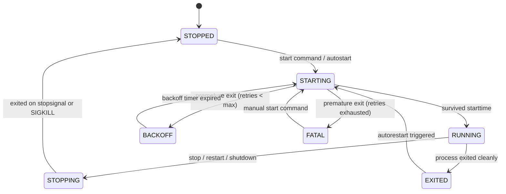

# Taskmaster

A robust, asynchronous job control supervisor and process manager written in Python, inspired by `supervisord` and `supervisorctl`. Developed in accordance with the **42 School Taskmaster Subject (v3.1)**.

Taskmaster provides reliable lifecycle management for long-running services and batch jobs, complete with finite state machine tracking, zero-downtime hot reloading, automatic retry policies, safe output redirection, an interactive CLI with autocompletion and persistent history, and a client/server daemon architecture over UNIX domain sockets.

---

## Table of Contents

1. [Features](#features)
2. [Architecture](#architecture)
   - [Process Finite State Machine](#process-finite-state-machine)
   - [Supervision & Hot Reloading](#supervision--hot-reloading)
   - [Client / Server Bonus](#client--server-architecture)
3. [Configuration Reference](#configuration-reference)
4. [Installation & Setup](#installation--setup)
5. [Usage](#usage)
   - [Mode 1: Standalone Supervisor (`taskmaster`)](#mode-1-standalone-supervisor-taskmaster)
   - [Mode 2: Client/Server Daemon (`taskmasterd` & `taskmasterctl`)](#mode-2-clientserver-daemon-taskmasterd--taskmasterctl)
6. [CLI Commands](#cli-commands)
7. [Automated Testing & Mock Binaries](#automated-testing--mock-binaries)
8. [Peer Defense Guide](#peer-defense-guide)

---

## Features

- **Strict Subject v3.1 Adherence**: Complete implementation of all 13 mandatory configuration keys, signal semantics, and process states.
- **Finite State Machine**: Strict process lifecycle transitions: `STOPPED` $\rightarrow$ `STARTING` $\rightarrow$ `RUNNING` $\rightarrow$ `STOPPING` $\rightarrow$ `EXITED` / `BACKOFF` $\rightarrow$ `FATAL`.
- **Zero-Downtime Configuration Reloading**:
  - Hot reloading on `reload` command or `SIGHUP` signal.
  - Three-way differential reconciler modifies or scales services in-place without killing or restarting untouched running processes.
- **Process Pooling & Scaling**:
  - `numprocs` pooling allows running multiple identical instances of a service.
  - Dynamic scaling up/down preserves existing active PIDs.
- **Graceful Termination & Fallback**:
  - Configurable termination signal (`stopsignal`, e.g. `SIGTERM`, `SIGINT`, `SIGHUP`, `SIGQUIT`).
  - Timeout countdown (`stoptime`), falling back to forceful `SIGKILL` if a stubborn process fails to exit.
- **Autorestart Strategies**:
  - `always`: Continuously restarts the process upon exit.
  - `never`: Leaves the process in `EXITED` state.
  - `unexpected`: Restarts only if the exit code is not within the defined `exitcodes` list.
  - Configurable `startretries` with exponential backoff before transitioning to `FATAL`.
- **Safe Output Redirection**:
  - `stdout` and `stderr` redirected to append-mode raw file descriptors (`os.open` with `O_APPEND`).
  - Log files are preserved across reloads without truncation or file descriptor leaks.
- **Interactive Control Shell**:
  - Built with `prompt_toolkit` (subject IV.1 compliant).
  - Tab autocompletion for commands and dynamic service names.
  - Persistent command history (`~/.taskmaster_history` and `~/.taskmasterctl_history`).
  - Fallback streaming mode for piped input (`echo status | taskmasterctl`).
- **Bonus Client / Server Architecture**:
  - Headless background supervisor daemon (`taskmasterd`).
  - Remote control client (`taskmasterctl`) supporting one-shot commands and interactive prompt over a local UNIX domain socket (`/tmp/taskmaster.sock`).

---

## Architecture

### Process Finite State Machine

Taskmaster models each process as an explicit state machine:



### Supervision & Hot Reloading

When `SIGHUP` or `reload` is triggered, the supervisor computes a differential plan between the active configuration and the new YAML file:
1. **Added Programs**: Spawned immediately if `autostart: true`.
2. **Removed Programs**: Gracefully stopped and pruned from the supervisor table.
3. **Scaled Programs**:
   - `numprocs` increased: New instances spawned; existing active PIDs remain undisturbed.
   - `numprocs` decreased: Excess instances terminated gracefully; remaining active PIDs continue running.
4. **Modified Programs**: If core execution parameters changed (`cmd`, `env`, `workingdir`, `umask`), the service is restarted with new settings. If only monitoring settings changed (`autorestart`, `stoptime`), parameters update in-place with **zero downtime**.
5. **Unchanged Programs**: Untouched, preserving 100% uptime.

### Client / Server Architecture

```
┌─────────────────────────────────┐
│     taskmasterd (Daemon)        │
│  ┌───────────────────────────┐  │
│  │     ServiceHandler        │  │
│  │  ┌───────────┐ ┌────────┐ │  │
│  │  │ Service A │ │Serv. B │ │  │
│  │  └───────────┘ └────────┘ │  │
│  └─────────────▲─────────────┘  │
│                │                │
│         IPCServer (asyncio)     │
│                │                │
└────────────────┼────────────────┘
                 │ UNIX Domain Socket (/tmp/taskmaster.sock)
┌────────────────┼────────────────┐
│         IPCClient (asyncio)     │
│                │                │
│  taskmasterctl (Client Shell)   │
│  - One-shot: `taskmasterctl status`
│  - Shell:    `taskmasterctl> `  │
└─────────────────────────────────┘
```

---

## Configuration Reference

Taskmaster accepts YAML configurations using either the standard Supervisor `programs:` dictionary format or the `services:` list format.

```yaml
programs:
  worker:
    cmd: "tests/programs/sleeper 100"
    numprocs: 2
    autostart: true
    autorestart: unexpected
    exitcodes:
      - 0
      - 2
    starttime: 2
    startretries: 3
    stopsignal: TERM
    stoptime: 5
    stdout: "logs/worker.stdout"
    stderr: "logs/worker.stderr"
    env:
      APP_ENV: "production"
    workingdir: "/tmp"
    umask: "022"
```

### Complete Configuration Fields

| Key | Type | Default | Description |
|:---|:---:|:---:|:---|
| `cmd` | `str` | *(Required)* | Command string to execute. Parsed safely using shell tokenization. |
| `numprocs` | `int` | `1` | Number of concurrent instances to supervise. |
| `autostart` | `bool` | `true` | Whether to launch the process automatically on supervisor startup. |
| `autorestart` | `str` | `unexpected` | Restart policy: `always`, `never`, or `unexpected`. |
| `exitcodes` | `list[int]` | `[0]` | Expected exit codes indicating normal/successful process completion. |
| `starttime` | `int` | `1` | Seconds the process must stay alive to transition from `STARTING` to `RUNNING`. |
| `startretries`| `int` | `3` | Maximum number of consecutive restart attempts before entering `FATAL`. |
| `stopsignal` | `str` | `TERM` | Signal used to gracefully stop the process (`TERM`, `INT`, `HUP`, `QUIT`, `KILL`, `USR1`, `USR2`). |
| `stoptime` | `int` | `5` | Grace period in seconds to wait for graceful exit before sending `SIGKILL`. |
| `stdout` | `str` | `None` | Path to file for redirecting standard output (opened with append mode). |
| `stderr` | `str` | `None` | Path to file for redirecting standard error (opened with append mode). |
| `env` | `dict` | `{}` | Key-value pairs of environment variables injected into the process environment. |
| `workingdir` | `str` | `None` | Working directory to switch into prior to executing the process. |
| `umask` | `str` / `int` | `022` | File creation mask applied prior to process execution (octal format). |

---

## Installation & Setup

### Prerequisites

- Python 3.11+
- Clang / GCC and Make (to compile test binaries)

### 1. Clone & Setup Environment

```bash
git clone https://github.com/eliasluimeme/taskmaster.git
cd taskmaster

# Create and activate virtual environment
python3 -m venv .venv
source .venv/bin/activate

# Install dependencies and taskmaster package in editable mode
pip install -e .
```

### 2. Compile Mock C Test Suite

```bash
make -C tests/programs
```

This compiles test binaries in `tests/programs/`:
- `sleeper`: Long-running worker process.
- `crasher`: Immediately crashes with exit code 1 to test restart limits and `FATAL` state.
- `sigignorer`: Catches and ignores `SIGTERM` to test `stoptime` timeout and forceful `SIGKILL` fallback.
- `flooder`: Emits structured output to stdout/stderr to verify stream redirection.
- `umask_checker`: Creates a file to verify octal umask inheritance.
- `env_checker`: Prints environment variables to verify environment injection.

---

## Usage

### Mode 1: Standalone Supervisor (`taskmaster`)

Runs the supervisor engine and interactive shell in the foreground:

```bash
taskmaster -c demo.yml
```

```text
2026-09-27 15:47:59 [INFO] [taskmaster] Taskmaster v0.1.0 initializing
Taskmaster Interactive Shell (Subject v3.1)
Type 'help' for commands, 'status' for process table, 'quit' to exit.

taskmaster> status
PROCESS           STATE    PID    UPTIME / EXIT
------------------------------------------------------------
worker:0          RUNNING  36527  0:00:12
worker:1          RUNNING  36528  0:00:12
crasher           STOPPED  -      -
stubborn          STOPPED  -      -
flooder           STOPPED  -      -
environment_test  STOPPED  -      -
taskmaster> quit
```

### Mode 2: Client/Server Daemon (`taskmasterd` & `taskmasterctl`)

Runs the supervisor as a headless daemon controlled remotely over a UNIX domain socket (`/tmp/taskmaster.sock`):

#### 1. Start Daemon:
```bash
taskmasterd -c demo.yml
```

#### 2. Control with `taskmasterctl`:

- **One-shot Commands:**
  ```bash
  taskmasterctl status
  taskmasterctl start stubborn
  taskmasterctl stop stubborn
  ```

- **Interactive Shell:**
  ```bash
  taskmasterctl
  taskmasterctl> status
  taskmasterctl> reload
  taskmasterctl> quit       # Exits client shell; daemon keeps running in background
  ```

- **Shutting Down the Daemon:**
  ```bash
  taskmasterctl shutdown   # Gracefully terminates all supervised child processes and exits daemon
  ```

---

## CLI Commands

| Command | Usage | Description |
|:---|:---|:---|
| `status` | `status [name ...]` | Display tabular status of all or specified processes. |
| `start` | `start <name ... \| all>` | Start one or more stopped, exited, or fatal processes. |
| `stop` | `stop <name ... \| all>` | Gracefully stop running processes using `stopsignal`. |
| `restart` | `restart <name ... \| all>` | Stop and immediately restart specified services. |
| `reload` | `reload [config_path]` | Hot reload configuration file without stopping the supervisor. |
| `tail` | `tail [-n N] <name> [err]` | View the last $N$ lines of stdout or stderr log files. |
| `shutdown`| `shutdown` | Gracefully terminate all child processes and shut down supervisor. |
| `help` | `help [command]` | Display available commands or syntax help. |
| `quit` | `quit` / `exit` | Exit the CLI shell. |

---

## Automated Testing & Mock Binaries

The project includes an automated test suite with **100% pass rate** covering unit, integration, and mock C binary supervision:

```bash
pytest -v
```

```text
============================= test session starts ==============================
collected 40 items

tests/test_cli.py::test_cli_help PASSED                                  [  2%]
tests/test_cli.py::test_cli_status PASSED                                [  5%]
tests/test_cli.py::test_cli_start_stop_restart PASSED                    [  7%]
tests/test_cli.py::test_cli_tail PASSED                                  [ 10%]
tests/test_cli.py::test_cli_quit PASSED                                  [ 12%]
tests/test_cli.py::test_cli_completions PASSED                           [ 15%]
tests/test_config.py::test_parse_signal PASSED                           [ 17%]
tests/test_config.py::test_parse_umask PASSED                            [ 20%]
tests/test_config.py::test_autorestart_enum PASSED                       [ 22%]
tests/test_config.py::test_valid_programs_dict PASSED                    [ 25%]
tests/test_config.py::test_valid_services_list PASSED                    [ 27%]
tests/test_config.py::test_missing_cmd PASSED                            [ 30%]
tests/test_config.py::test_invalid_numprocs PASSED                       [ 32%]
tests/test_config.py::test_duplicate_services PASSED                     [ 35%]
tests/test_config.py::test_unknown_keys PASSED                           [ 37%]
tests/test_config.py::test_load_from_file PASSED                         [ 40%]
tests/test_config.py::test_file_not_found PASSED                         [ 42%]
tests/test_integration_c_programs.py::test_c_sleeper_normal_flow PASSED  [ 45%]
tests/test_integration_c_programs.py::test_c_sigignorer_sigkill_fallback PASSED [ 47%]
tests/test_integration_c_programs.py::test_c_crasher_fatal_state PASSED  [ 50%]
tests/test_integration_c_programs.py::test_c_flooder_output_streams PASSED [ 52%]
tests/test_integration_c_programs.py::test_c_umask_enforcement PASSED    [ 55%]
tests/test_integration_c_programs.py::test_c_env_checker PASSED          [ 57%]
tests/test_ipc.py::test_ipc_client_server_communication PASSED           [ 60%]
tests/test_ipc.py::test_ipc_client_when_server_not_running PASSED        [ 62%]
tests/test_ipc.py::test_ipc_shutdown_command PASSED                      [ 65%]
tests/test_logger.py::test_logger_setup_and_write PASSED                 [ 67%]
tests/test_logger.py::test_logger_level_filtering PASSED                 [ 70%]
tests/test_logger.py::test_namespaced_logger PASSED                      [ 72%]
tests/test_process.py::test_process_normal_lifecycle PASSED              [ 75%]
tests/test_process.py::test_process_early_exit_backoff_and_fatal PASSED  [ 77%]
tests/test_process.py::test_process_output_redirection PASSED            [ 80%]
tests/test_process.py::test_process_env_and_workingdir PASSED            [ 82%]
tests/test_reload.py::test_hot_reload_lifecycle PASSED                   [ 85%]
tests/test_service.py::test_service_pool_creation_and_autostart PASSED   [ 87%]
tests/test_service.py::test_service_adjust_numprocs_scale_up_and_down PASSED [ 90%]
tests/test_supervision.py::test_autorestart_always PASSED                [ 92%]
tests/test_supervision.py::test_autorestart_unexpected PASSED            [ 95%]
tests/test_supervision.py::test_sigkill_fallback PASSED                  [ 97%]
tests/test_supervision.py::test_service_handler_operations PASSED        [100%]

============================= 40 passed in 32.37s ==============================
```

---

## Peer Defense Guide

For 42 School peer evaluations, follow the step-by-step evaluation script detailed in [DEFENSE.md](DEFENSE.md), covering:
1. Configuration loading and syntax validation.
2. Starting, stopping, and restarting child processes.
3. Process state machine verification (`STARTING`, `RUNNING`, `BACKOFF`, `FATAL`).
4. Autorestart policies (`always`, `never`, `unexpected`).
5. Signal handling and fallback to forceful `SIGKILL`.
6. Zero-downtime hot reloading with PID preservation on `SIGHUP`.
7. Client/Server daemon communication and remote control.
